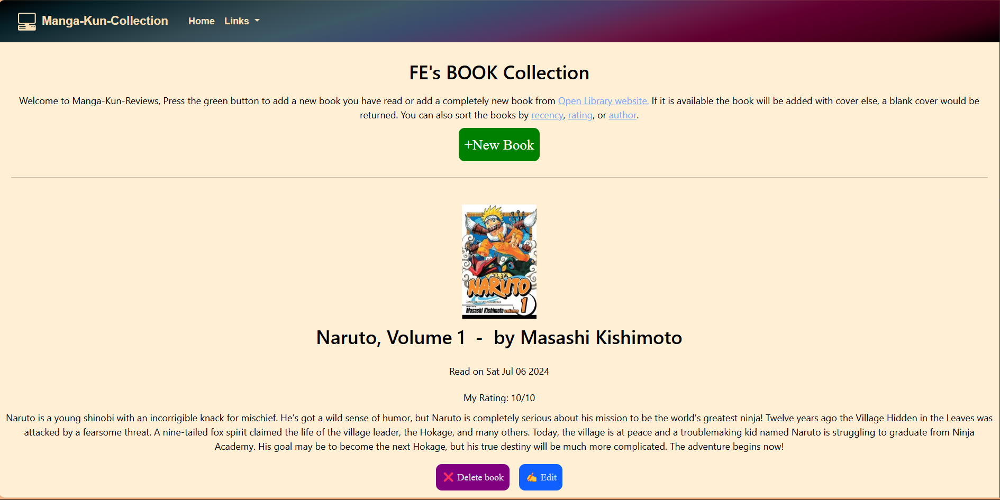
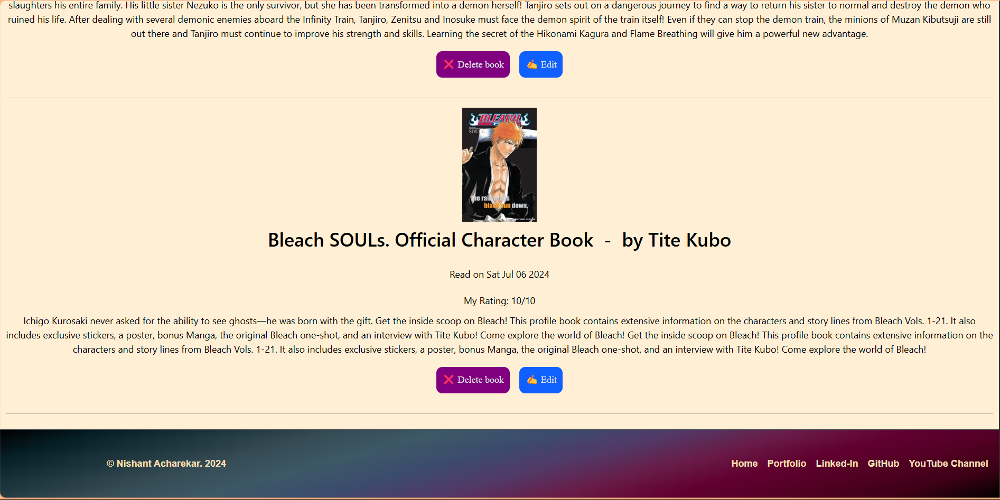
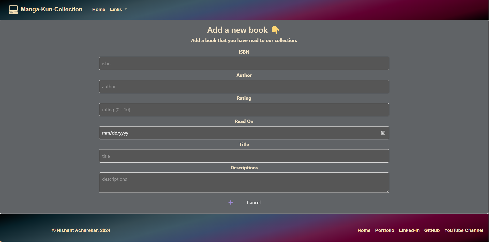
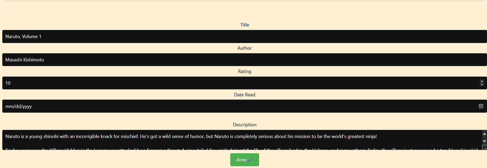

Manga-Kun-Reviews

This project is a book collection application built with Node.js, Express, and PostgreSQL. The application allows users to add, view, edit, and delete books from their collection. Each book entry includes details like the ISBN, author, title, description, rating, and the date it was read. Additionally, the application fetches and displays book covers from the Open Library API.

Install the project in any directory then go to that directory by the command terminal

cd "your project directory"

Make sure you have Node and Nodemon, then run "npm install" and then "npm i nodemon"

Also Run the queries.sql file

then run the project "nodemon index.js"

Made By Nishant Acharekar

# front pages

# add book 

# edit book

