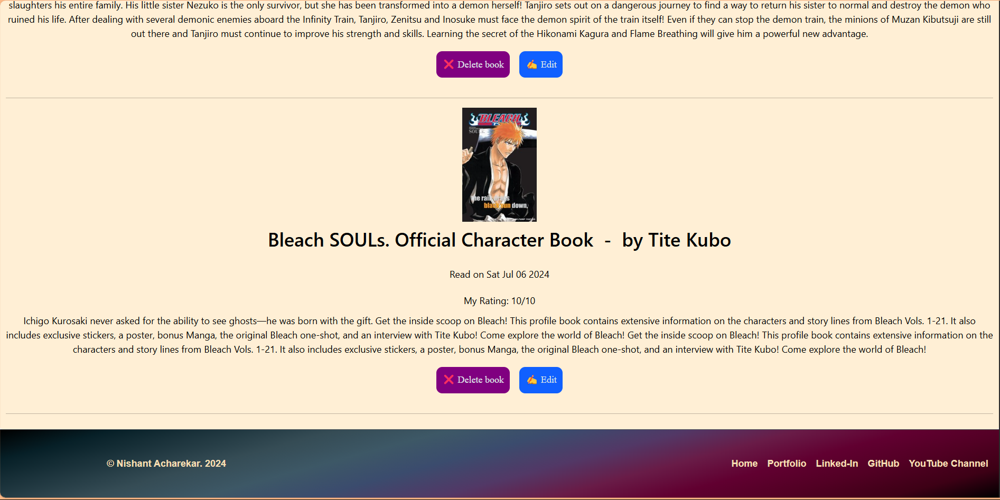
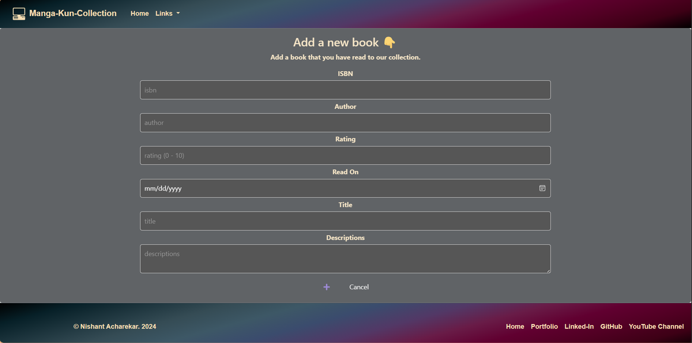
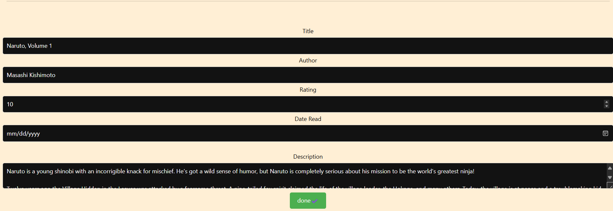

Manga-Kun-Reviews 

Github Link: https://github.com/NishantA9/Manga-Kun-Reviews

Manga-Kun Reviews is a personal book collection web application built using Node.js, Express, PostgreSQL, and EJS.
The application allows users to add, view, edit, and delete books they have read through a clean CRUD-based workflow.

Each book entry includes:
1) Title
2) Author
3) ISBN
4) Description
5) Personal rating
6) Date read

The application also integrates with the Open Library Covers API to fetch and display book cover images based on ISBN.
If a cover is unavailable, the app gracefully falls back without breaking the user experience.

✨ Features
1) View a list of all books in the collection.
2) Add new books with metadata and ISBN.
3) Edit existing book details inline
4) Delete books from the collection
5) Sort books by:
    Most recent read
    Rating
    Author name
6) Fetch and display book covers using the Open Library API

🛠 Tech Stack

Backend: Node.js, Express
Frontend: EJS (server-side rendering), HTML, CSS, Bootstrap
Database: PostgreSQL
External API: Open Library Covers API
Other Tools: Axios, Nodemon

⚙️ Setup Instructions
1) Install the project in any directory and navigate to it using the terminal: cd your-project-directory

2) Install dependencies:
npm install
npm install nodemon

3) Create a .env file with your PostgreSQL credentials:
DB_USER=
DB_HOST=
DB_DATABASE=
DB_PASSWORD=
DB_PORT=

4) Run the SQL queries from queries.sql to set up the database tables.
Start the server: nodemon index.js
Open the application in your browser: http://localhost:3000

🔮 Future Improvements
1) Add authentication and user-specific book collections
2) Improve form validation and error handling
3) Add pagination and search functionality
4) Refactor frontend interactivity using a client-side framework

Made By Nishant Acharekar

# front pages

# add book 

# edit book

